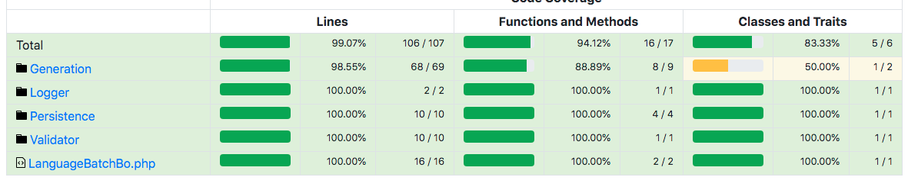

# Task:
Your task is to refactor the LanguageBatchBo!

The solution will be evaluated based on the following goals:
* Keep the original functionality.
* Increase the inner code quality.
* Increase test coverage with unit tests.

# Rules:
* Create local git repository for the project.
* Commit after each coding step, when the system is in working condition.
* The interface of the LanguageBatchBo can't be changed (the generate_language_files.php should remain the same), but (of course) it's content can change and it can be split into new classes.
* The ApiCall, and Config classes are mock/simplified versions of the original dependencies, they can not be changed.
* The error message of the exceptions can be simplified.
* The console output of the script doesn't have to be the same as in the original version.
* Use PHPUnit as testing framework.
* Inline comments are not necessary.
* You can clone this repository, but the homework should be sent to us via email (including the git files) and it should not be shared on github, or otherwise on the internet. 

# Instructions

To run your project with docker you can create you image with command:
```
docker build -t pedromazala/php:docler-holding .
```

Then you can run your container with following command:
```
 docker run -it -v $(pwd):/app --workdir /app --rm pedromazala/php:docler-holding
```

Inside your container run install project dependencies:
```
composer install
```

Now you can run the tests
```
vendor/bin/phpunit
```

This command generate a report in `./tests/_reports` with coverage data.
You will have a report like this:


